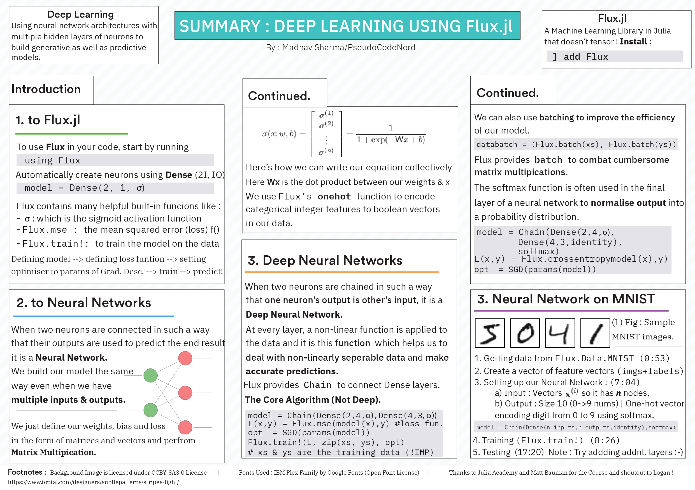

# deeplearning-cheatsheet

## 👨‍💻🎨 Design Task
also the task in which I was most tense since before the submission deadline, Illustrator and consequently my laptop hanged for an hour and lo behold, when It came back...

all of my work on the reference sheet vanished into thin air and I missed claiming my last task (30th) by 5 seconds when my mentor asked me to add time stamps at the last minute on slack
(ALEXA PLAY sad Despacito)

## Deliverable
1. Deep Learning Reference Sheet
- .AI [File](./Untitled-1.ai)
- .pdf [File](./edited.pdf)

## Design a one page summary of the Deep Learning with Flux.jl course on JuliaAcademy

### Task Description

This task is designed for students who have completed the task titled: "Complete the "Deep Learning with Flux.jl" course on JuliaAcademy.com"

For this task, you will create a well-formatted and visually appealing one page summary of the course. This summary should include key ideas that were covered in the course.

This summary should not include huge code chunks unless that was the main focus of the section. Try to make things as simple and human-readable as possible while still summarizing the course material.

Submit the PDF here once done.

Note that by submitting content for this course, you acknowledge and consent to potentially having the material be used for this course under an MIT license.
