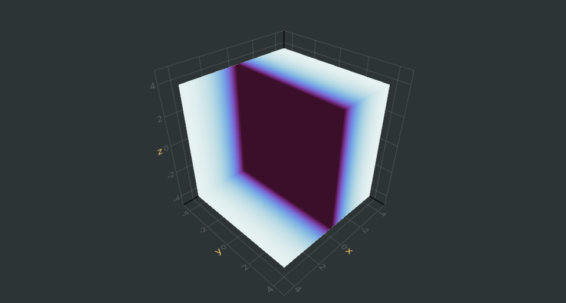

# makie.jl-prog-attributuMaximum

##  👨‍💻 Code & Blog Task 📄

## Deliverable

**BG:** Makie.jl is a high-performance, extendable, and multi-platform plotting package for Julia. I made a Volume Plot 

---

1. Makie.jl program utilizing as many attributes as possible
    - [Source](./plot.jl)
2. [Blog Post](https://madhavscsblog.netlify.com/2020/01/09/makie_example.html) on **my CS Blog**
    - If you'd like to view it as a `.md` file, [here](./2020-1-9-makie_example.md) you go...
  
Attributes utilised are listed below :

- backgroundcolor,
- algorithm,
- colormap,
- linewidth,
- visible,
textcolor,
- color,
- align,
- textsize,
- save (for saving image.)

Final Plot Image

---

## Create a Makie.jl program utilizing as many attributes as possible.

Some of the[ docs for Makie.jl](http://makie.juliaplots.org/dev/) reference [attributes](http://makie.juliaplots.org/dev/) that you can use. However, the actual usage of those attributes may not be clear to some people.

**Create an example Makie.jl program and corresponding blog post/GitHub gist(or just comments in the code) that explain the code and utilizes as many possible different parts of Makie as possible.** The overarching goal is to show how to reference and use as many attributes as possible available in Makie.jl.

---