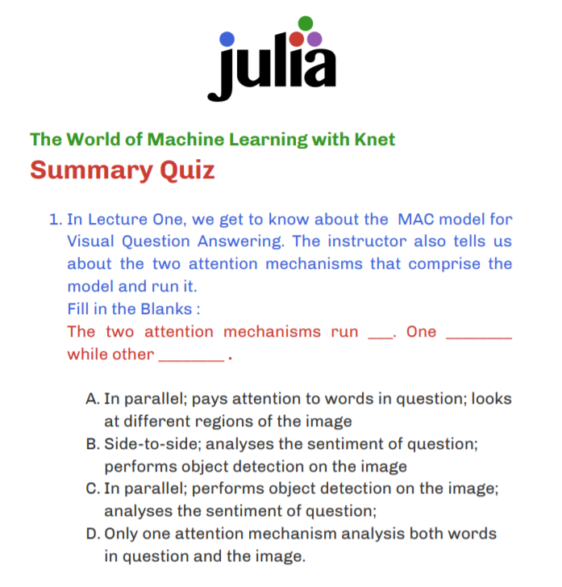

# quiz-ML-with-Knet.jl

## 🎨 Quiz Design Task 💡

## Deliverable

### [The Quiz .pdf](./EndOfCourse_Quiz.pdf) (under MIT License)

I created the **End Of Course Quiz** for the World of Machine Learning with Knet course.

The course was really advanced with lectures ranging from Visual Question and Answering, Image Recognition and Language Models.

It provided very little theory, thus limiting the number of *good* questions. The course was **heavy on implementation** but still some questions **have been** made to test the students’ knowledge gathered from all the videos.

I tried my best to adhere to the [official JuliaLang Color Scheme](https://github.com/JuliaLang/julia-logo-graphics) and the end result came out to be pretty nice-looking (+typography too..)

---

## Design a quiz for the Introduction to Julia course on JuliaAcademy.com

*This task is designed for students who have completed the task titled: "Complete the "World of Machine Learning with Knet" course on JuliaAcademy.com"*

Create a simple 7-10 question multiple-choice quiz (it can have less than 7-10 questions if the video is short). Each question should have 4 choices.

Topics must be picked from the below list:

- Visual Question and Answering
- Handwriting Recognition in Julia
- Sentiment Analysis
- Language Modeling
- Image Classification
- A final summary test consisting of questions for the entire course ✔️

Please claim your topic on [this thread](https://github.com/JuliaComputing/JuliaAcademyMaterials/issues/53)

****Note that these quizzes can only cover material that was found in the actual videos that are in the World of Machine Learning with Knet on JuliaAcademy.org.**** Please do not reference or ask questions about outside material that the person taking the quiz may not know.

Note that by submitting content for this course, you acknowledge and consent to potentially having the material be used for this course under an MIT license.

---