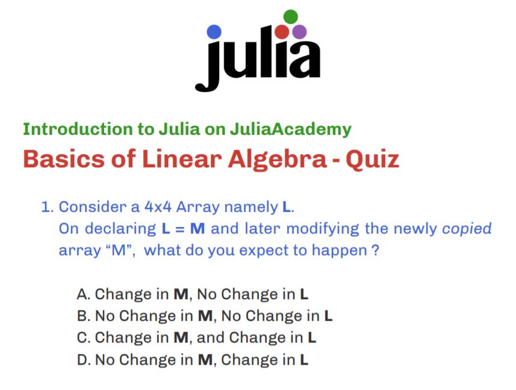

# quiz-julia-lang

## 🎨 Quiz Design Task 💡

## Deliverable

### [The Quiz .pdf](./Basics_of_Linear_Algebra_-_Quiz.pdf)

I created a quiz on **Basics of Linear Algebra** lectures in the Introduction to Julia Course.

The course had lectures on how to do Linear Algebra with Julia (it's really simple with Julia 😄).

It was under **Advanced Julia Topics** and my quiz is being used as a test to check lecture understanding of the students as an official after lecture test.

I tried my best to adhere to the [official JuliaLang Color Scheme](https://github.com/JuliaLang/julia-logo-graphics) and the end result came out to be pretty nice-looking (+typography too..)

---

## Design a quiz for the Introduction to Julia course on JuliaAcademy.com

**This task is designed for students who have completed the task titled: "Complete the "Introduction to Julia" course on JuliaAcademy.com"**

Create a simple 7-10 question multiple-choice quiz. Each question should have 4 choices.

Topics must be picked from the below list:

- Control Flow
- Packages
- Plotting
- Multiple Dispatch
- Basic Linear Algebra ✔️
- "Julia is fast"

Please claim your topic on [this thread](https://github.com/JuliaComputing/JuliaAcademyMaterials/issues/42)

*Note that these quizzes can only cover material that was found in the actual videos that are in the Introduction to Julia course on JuliaAcademy.org.* Please do not reference or ask questions about outside material that the person taking the quiz may not know.

To submit the task, upload a basic PDF with the questions and the 4 possible answers for each question.

---