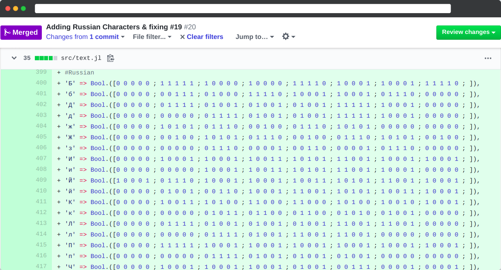

# senshat-font-add

## 👨‍💻 Code Task 👨‍💻

I learnt basics of cyrillic and Russian.

## Deliverable
[**PR**](https://github.com/JuliaBerry/SenseHat.jl/pull/20#issue-365114429)
1. Pull Request containing Russian Letters mapped in 8x5 Boolean Arrays (phew it was tiring and intriguing at the same time.)

How some of it looks like,

## Implement fonts for more languages for SenseHat.jl

### Task Description

The current set of fonts available within the SenseHat library are limited to English/Latin characters. Implement font shapes for other languages, based on what languages you can read and speak. For example, Cyrillic, Greek, Arabic, Indic languages are all possible options.

Current font definitions for English are [here](https://github.com/JuliaBerry/SenseHat.jl/blob/218cad53556d2637e87b631d4539a424ff92eba1/src/text.jl#L63)

The fonts should be added as a PR to the [SenseHat.jl](https://github.com/JuliaBerry/SenseHat.jl) package. There are multiple instance counts available for this task, but we expect each language to be done just once. Please let your mentor know which language you are working on after accepting this task.

