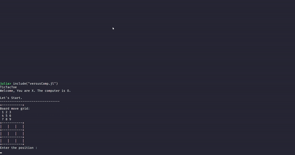

# tic-tac-toe.jl

# 🎮 Make A Game Task 👨‍💻

>Part of my [games-in-julia](https://github.com/PseudoCodeNerd/games_in_julia) series.

## Deliverable
1. Tic-Tac-Toe (AI & PvP)

### Source

1. [```versusComp.jl```](./versusComp.jl)

2. [```versusHuman.jl```](./versusHuman.jl)

### Gameplay

**Computer v/s Homo Sapien**



<hr>

**Homo Sapien v/s Homo Sapien**


<hr>

## Task Description

The board of the game can be created using a basic 2-D Array or with GTK.jl.
The game should have a 2 person mode and also a single-player mode where you play against a basic AI.
Play using the console, with a single-player against the computer. Start with a simple, rule-based computer-player. Add some AI capabilities to improve the quality of the computer-player.

The final submission should include a GitHub Gist or GitHub Repo with the code and examples of the game being played in both modes.

<hr>